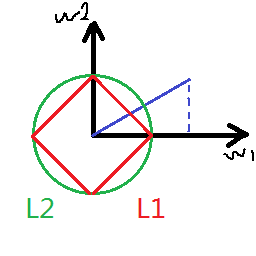

# vector *normalization*

常见的向量正则化(vector *normalization* )有两种方式：L1正则化和L2正则化。

对于向量$\vec w=[w_0, w_1, ...w_n]$，有L1正则化为：
$$
{\lVert\vec w\rVert_1} =|w_1| + |w_2|+...+|w_n|
$$
L2正则化为：
$$
{\lVert\vec w\rVert_2} =\sqrt {w_1^2 + w_2^2+...+w_n^2}
$$
在简单的二维情况下，图形化之后可以看到，

L2正则化的结果可以用蓝色线段的斜边表示，而L1正则化的结果是两个直角边的和，可知L1大于L2。

# 固定长度时L1和L2的图形化

上图中绿色的圆表示L2距离固定的情况，红色的菱形表示L1距离固定的情况。

# 参考

https://youtu.be/5fN2J8wYnfw