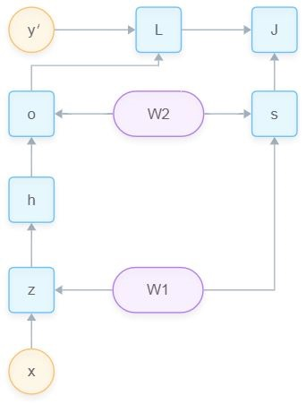
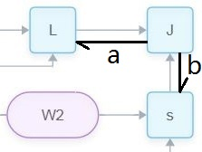
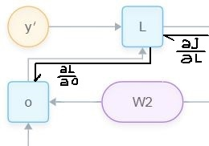
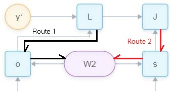
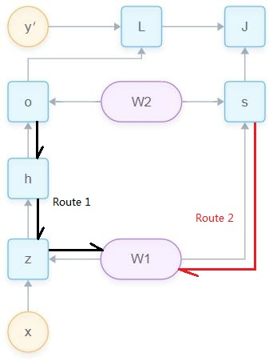

# 简介

深度学习算法主要包括两部分：

- 前向计算
- 反向传播

代入权重矩阵W和偏置矩阵b得到预测值$y=f(W,x)+b$ ，通过Loss函数得到当前预测的误差大小。反向计算$L=Loss(W,b)$得到误差值L对于权重矩阵和偏置矩阵b的梯度gradient，利用gradient来更新W和b使得误差值L逐步减小。

# Back Propagation

反向传播把复杂的运算转换成一个个简单的运算节点Dot。然后反向对各个参数求梯度时，整体的复杂求导运算就可以简化为各个节点Dot的链式求导。

## add

gradient distrabuter
$y=a+b$，此时y处的梯度$ \frac {\partial L} {\partial y}$直接不加改变地传递到a和b上。

## mul

gradient switcher
$y=a*b$，此时y处的梯度$ \frac {\partial L} {\partial y}$传递到a时需要乘以b，传递到b时需要乘以a。

## max

gradient router
$y=max(a, b)$，此时y处的梯度$ \frac {\partial L} {\partial y}$直接传递到a或者b上。故a等于y处传来的梯度，b等于0；或者a等于0，而b等于y处传来的梯度。

## vector or matrix production

对于$Y = W \cdot X$，结合Y的形状可以帮助推断$\frac {\partial Y}{\partial X}$，$\frac {\partial Y}{\partial W}$的形状。

# 例子

## 定义模型

下面针对一个简单的2层神经网络来尝试一下梯度的反向传播。

约定$\boldsymbol{x} \in \mathbb{R}^x$

**输入**：样本为$(\boldsymbol{x}, y)$，设特征$\boldsymbol{x} \in \mathbb{R}^x$，$y'$为y维的离散的标签。

**第一层**：
$$
\boldsymbol{z} = \boldsymbol{W}^{(1)} \boldsymbol{x}
$$
其中$\boldsymbol{W}^{(1)} \in \mathbb{R}^{h \times x}$，得到$\boldsymbol{z} \in \mathbb{R}^h$。

第一层的非线性变换：
$$
\boldsymbol{h} = \phi (\boldsymbol{z})
$$
对$\boldsymbol{z}$按元素通过$\phi()$，得到和$\boldsymbol{z}$尺寸相同的$\boldsymbol{h} \in \mathbb{R}^h$。

**第二层**：
$$
\boldsymbol{o} = \boldsymbol{W}^{(2)} \boldsymbol{h}
$$
其中$\boldsymbol{W}^{(2)} \in \mathbb{R}^{y \times h}$，得到$\boldsymbol{o} \in \mathbb{R}^y$。注意o和样本中的标签$y'$尺寸相同。

**损失函数**：
$$
L = \ell(\boldsymbol{o}, y^\prime)
$$
根据计算输出$\boldsymbol{o}$和样本$y'$计算误差(损失)。可以有平方和误差，交叉熵误差等方式。

**正则化误差**：
$$
s = \frac {\lambda}{2}\sum_{i}\|\boldsymbol{W}^{(i)}\|_F^2
$$
本例中采用了L2误差项(F=2)，其中$\lambda$是超参数。表示对一个权重矩阵的所有元素求平方和，然后对所有矩阵做相同处理再相加，最后乘以lambda除以2，得到s。

最终误差为，
$$
J=L+s
$$
所以最后的问题归结为，如何得到一组权重矩阵W，使得J(也被称为目标函数)有最小值。得到了这组权重W就完成了对模型的训练。

## 模型计算图

### 正向传播

在反向求梯度之前，需要先争次昂做一次传播，即从输入开始按照上面定义的计算图的方向，计算并存储各个节点的输出。这些节点的输出值在反向传播中会出现在梯度公式里，后面会有介绍。

### 反向传播

由上文中的模型可知，J是关于$\boldsymbol{W}^{(1)}$和$\boldsymbol{W}^{(2)}$的函数。要使得J取到最小值，需要计算J对于W的梯度$\partial J/\partial \boldsymbol{W}^{(1)}$、$\partial J/\partial \boldsymbol{W}^{(2)}$，然后按照梯度的反方向更新W，经过N次迭代之后，理论上J就可以取到最小值。

为了表述方便，输入输出$\mathsf{X}, \mathsf{Y}, \mathsf{Z}$为任意形状的张量，有函数$\mathsf{Y}=f(\mathsf{X})$和$\mathsf{Z}=f(\mathsf{Y})$。根据链式求导法则有，
$$
\frac{\partial \mathsf{Z}}{\partial \mathsf{X}} = \text{prod}(\frac{\partial \mathsf{Z}}{\partial \mathsf{Y}}, \frac{\partial \mathsf{Y}}{\partial \mathsf{X}})
$$
下面，针对上文的模型进行反向传播求梯度。

**J对L和s的梯度：**

正则化误差$J=L+s$，且J、L和s均为标量。故J对L和s求梯度有
$$
\frac{\partial J}{\partial L} = 1,
$$

$$
\frac{\partial J}{\partial s} = 1.
$$

**J对o的梯度：**

$$
\frac{\partial J}{\partial \boldsymbol{o}}
= \text{prod}(\frac{\partial J}{\partial L}, \frac{\partial L}{\partial \boldsymbol{o}})
= \frac{\partial L}{\partial \boldsymbol{o}}
$$
此处，J是标量，$\boldsymbol{o}$是尺寸为$\boldsymbol{o} \in \mathbb{R}^y$的向量。

**s对W的梯度：**
$$
\frac{\partial s}{\partial \boldsymbol{W}^{(1)}} = \lambda \boldsymbol{W}^{(1)},
$$

$$
\frac{\partial s}{\partial \boldsymbol{W}^{(2)}} = \lambda \boldsymbol{W}^{(2)}.
$$

**J对W2的梯度：**

可以看到有两条从J到W2的路径，所以J 对W2的梯度应该分别对每条路径求梯度，然后把二者相加。

路径一：
$$
\frac{\partial J}{\partial \boldsymbol{W}^{(2)}}
= \text{prod}( \frac{\partial L}{\partial \boldsymbol{o}}, \frac{\partial \boldsymbol{o}}{\partial \boldsymbol{W}^{(2)}})
$$
等号左边，J是标量，W2尺寸为(y, h)，故有$\frac{\partial J}{\partial \boldsymbol{W}^{(2)}} \in \mathbb{R}^{y \times h}$；

等号右边第一项，L是标量，o尺寸为(y,)，故有$\frac{\partial L}{\partial \boldsymbol{o}} \in \mathbb{R}^{y}$；

等号右边第二项，o尺寸为(y,)，W2尺寸为(y, h)。要得到$\mathbb{R}^{y \times h} = \text{prod}(\mathbb{R}^{y}, \mathbb{R}^{??})$，可知此处prod为矩阵点乘，而且尺寸变换方式为，(y, h) = (y, 1)dot(1, h)，故有$\frac{\partial \boldsymbol{o}}{\partial \boldsymbol{W}^{(2)}} \in \mathbb{R}^{1 \times h}$。
$$
\frac{\partial J}{\partial \boldsymbol{W}^{(2)}}
= \text{prod}(\frac{\partial J}{\partial \boldsymbol{o}}, \frac{\partial \boldsymbol{o}}{\partial \boldsymbol{W}^{(2)}})
= \frac{\partial J}{\partial \boldsymbol{o}} \boldsymbol{h}^\top 
$$
路径二：
$$
\frac{\partial J}{\partial \boldsymbol{W}^{(2)}}
= \text{prod}( \frac{\partial J}{\partial \boldsymbol{s}}, \frac{\partial \boldsymbol{s}}{\partial \boldsymbol{W}^{(2)}})
$$
跟上面的思考方式相同，等号左边尺寸为(y, h)，等号右边第一项尺寸为标量，第二项尺寸为(y, h)。
$$
\frac{\partial J}{\partial \boldsymbol{W}^{(2)}}
= \text{prod}(\frac{\partial J}{\partial s}, \frac{\partial s}{\partial \boldsymbol{W}^{(2)}})
= \lambda \boldsymbol{W}^{(2)}
$$
最后，两条路径相加之后得到：
$$
\frac{\partial J}{\partial \boldsymbol{W}^{(2)}}
= \text{prod}(\frac{\partial J}{\partial \boldsymbol{o}}, \frac{\partial \boldsymbol{o}}{\partial \boldsymbol{W}^{(2)}}) + \text{prod}(\frac{\partial J}{\partial s}, \frac{\partial s}{\partial \boldsymbol{W}^{(2)}})
= \frac{\partial J}{\partial \boldsymbol{o}} \boldsymbol{h}^\top + \lambda \boldsymbol{W}^{(2)}
$$
**J对W1的梯度：**

继续反向传播，求J对h的梯度。等号左边尺寸为(h, )，等号右边第一项(y, )，第二项(y, h)。要使等式成立，那么应该是(h, y)dot(y, )，所以有：
$$
\frac{\partial J}{\partial \boldsymbol{h}}
= \text{prod}(\frac{\partial J}{\partial \boldsymbol{o}}, \frac{\partial \boldsymbol{o}}{\partial \boldsymbol{h}})
= {\boldsymbol{W}^{(2)}}^\top \frac{\partial J}{\partial \boldsymbol{o}}
$$
继续反向传播，求J对于z的梯度。等号左边尺寸为(h, )，等号右边第一项(h, )，第二项$\partial J/\partial \boldsymbol{z}$直接$\phi$对z求导为标量或者broadcast后的(h, )。要使等式成立，那么应该是(h,  )$\odot$(h,  )，所以有：
$$
\frac{\partial J}{\partial \boldsymbol{z}}
= \text{prod}(\frac{\partial J}{\partial \boldsymbol{h}}, \frac{\partial \boldsymbol{h}}{\partial \boldsymbol{z}})
= \frac{\partial J}{\partial \boldsymbol{h}} \odot \phi^\prime(\boldsymbol{z})
$$
继续反向传播，求J对于W1的梯度。等号左边尺寸为(h, x)，等号右边第一项(h,  )，第二项(x, )。要使等式成立，那么应该是(h, 1)dot(1, x)，所以有：
$$
\frac{\partial J}{\partial \boldsymbol{W}^{(1)}}
= \text{prod}(\frac{\partial J}{\partial \boldsymbol{z}}, \frac{\partial \boldsymbol{z}}{\partial \boldsymbol{W}^{(1)}})
= \frac{\partial J}{\partial \boldsymbol{z}} x^\top
$$
由于J到W1也有两条路径，所以也要把两条路径的梯度相加：
$$
\frac{\partial J}{\partial \boldsymbol{W}^{(1)}}
= \text{prod}(\frac{\partial J}{\partial \boldsymbol{z}}, \frac{\partial \boldsymbol{z}}{\partial \boldsymbol{W}^{(1)}}) + \text{prod}(\frac{\partial J}{\partial s}, \frac{\partial s}{\partial \boldsymbol{W}^{(1)}})
= \frac{\partial J}{\partial \boldsymbol{z}} \boldsymbol{x}^\top + \lambda \boldsymbol{W}^{(1)}.
$$
注意，

- 上述反向传播过程中，每个节点的的梯度值都需要存储下来，以为继续向深处传播时，会用到之前计算的梯度。这样就不必重新计算，从而节省了宝贵的计算时间。
- 另外，反向传播时会用到中间变量h、z等的值，而这些值就是通过前向传播计算得到的。所以，反向传播依赖于正向传播得到的节点输出值。

# 参考

[动手学深度学习第十三课：正向传播、反向传播和通过时间反向传播](https://www.youtube.com/watch?v=xPFbbLxegH0&t=3011s)

