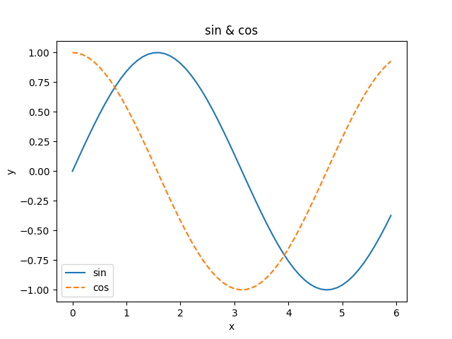

# Basic of Matplotlib

```python
import numpy as np
import matplotlib.pyplot as plt

x = np.arange(0,6,0.1)

y1 = np.sin(x)
y2 = np.cos(x)

# draw graph
plt.plot(x, y1, label="sin")
plt.plot(x, y2, linestyle="--", label="cos")

plt.xlabel("x")
plt.ylabel("y")
plt.title("sin & cos")
plt.legend()

plt.show()
```

Result:

