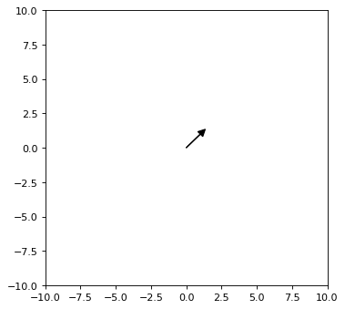

# matplotlib显示箭头

梯度下降法中要可视化显示梯度变化情况时，通过matplotlib可以直观地输出结果。
以下是实现方法：

```python
%matplotlib inline
import matplotlib.pyplot as plt

plt.figure(figsize=(5,5),dpi=80)
ax = plt.axes()
ax.set_xlim(-10, 10)
ax.set_ylim(-10, 10)

ax.arrow( -0.0, -0.0, 1.0, -1.0, fc="k", ec="k", head_width=0.5, head_length=0.5 )
plt.show()
```



