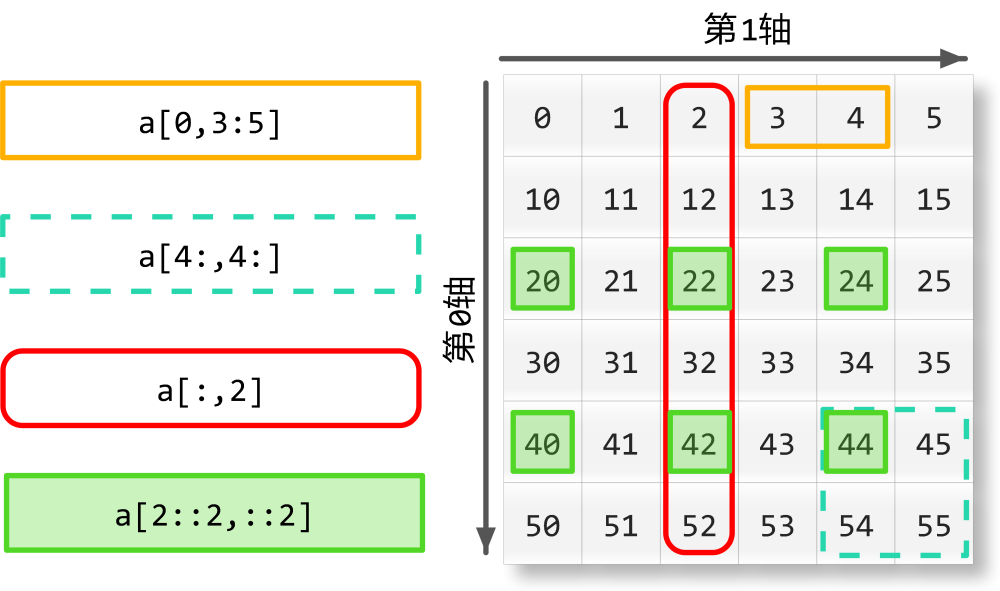

# Numpy.sum(ndarray, axis=1)

## sum

```python
import numpy as np

>>> a=np.arange(10).reshape(2,5)

>>> np.sum(a)
45
>>> np.sum(a,axis=1)
array([10, 35])
>>> np.sum(a,axis=0)
array([ 5,  7,  9, 11, 13])
```




[Image from](https://www.cnblogs.com/yyxayz/p/4033736.html)