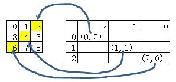

# Python List Slice

首先回顾Python的基本切片功能。注：list和tuple都可以进行切片。

## 一维数据

使用[]切片：

```python
# list切片得到一个新的list
>>> a=[1,2,3,4,5]
>>> a[1:3]
[2, 3]

# tuple切片得到一个新的tuple
>>> b=(1,2,3,4,5)
>>> b[1:3]
(2, 3)
```

使用slice对象切片：

```python
# slice(start,end,step)函数生成一个slice对象 注意函数的参数之间是逗号
# 用slice对象来实现slice
>>> x=slice(1,3,1)
>>> b[x]
(2, 3)
```

## 二维数据

```python
>>> c=[[1,2,3],[4,5,6],[7,8,9]]
# 取行
>>> c[0:2]
[[1, 2, 3], [4, 5, 6]]
# 取行列
# 直接行列一起取会错误
>>> c[0:2,0:1]
Traceback (most recent call last):
  File "<stdin>", line 1, in <module>
TypeError: list indices must be integers or slices, not tuple
# 可以先行再列
>>> c[0:2][0:2]
[[1, 2, 3], [4, 5, 6]]
```

# Numpy Array Slice

## 一维ndarray

对于一维的ndarray，Numpy和Python的slice方式相同，可以使用[]或者slice()函数来实现。

### 使用slice()函数

```python
>>> import numpy as np
>>> d=np.arange(10)
>>> d
array([0, 1, 2, 3, 4, 5, 6, 7, 8, 9])

# 用[start:end:step]
# 前闭后开 负数表示从后往前数
>>> d[:2]
array([0, 1])

# 用slice()函数
# x用的是上面的slice对象
>>> d[x]
array([1, 2])
```

### 使用[]

正向，stride为正（默认） 

```python
>>> seq[:]                # [seq[0],   seq[1],          ..., seq[-1]    ]
>>> seq[low:]             # [seq[low], seq[low+1],      ..., seq[-1]    ]
>>> seq[:high]            # [seq[0],   seq[1],          ..., seq[high-1]]
>>> seq[low:high]         # [seq[low], seq[low+1],      ..., seq[high-1]]
>>> seq[::stride]         # [seq[0],   seq[stride],     ..., seq[-1]    ]
>>> seq[low::stride]      # [seq[low], seq[low+stride], ..., seq[-1]    ]
>>> seq[:high:stride]     # [seq[0],   seq[stride],     ..., seq[high-1]]
>>> seq[low:high:stride]  # [seq[low], seq[low+stride], ..., seq[high-1]]
```

Examples:

```python
>>> import numpy as np
>>> a=np.array([[1,2,3],[4,5,6],[7,8,9]])
>>> a
array([[1, 2, 3],
       [4, 5, 6],
       [7, 8, 9]])
>>> a[0:2]
array([[1, 2, 3],
       [4, 5, 6]])
>>> a[::2]
array([[1, 2, 3],
       [7, 8, 9]])
```

If `stride` is negative, we will use counting down order:

```python
>>> seq[::-stride]        # [seq[-1],   seq[-1-stride],   ..., seq[0]    ]
>>> seq[high::-stride]    # [seq[high], seq[high-stride], ..., seq[0]    ]
>>> seq[:low:-stride]     # [seq[-1],   seq[-1-stride],   ..., seq[low+1]]
>>> seq[high:low:-stride] # [seq[high], seq[high-stride], ..., seq[low+1]]
```

Examples:

```python
>>> a[3::-1]
array([[7, 8, 9],
       [4, 5, 6],
       [1, 2, 3]])
```

### 用Comma选择列

`ndarray[:, 0]` means `ndarray[first_row:last_row, column_0]`

```python
>>> a
array([[1, 2, 3],
       [4, 5, 6],
       [7, 8, 9]])

>>> a[::2,2]
array([3, 9])
```

## 二维ndarray

### 简单取块

基本语法为ndarray[行操作,列操作]

```python
>>> array=np.arange(12).reshape((3,4))
>>> array
array([[ 0,  1,  2,  3],
       [ 4,  5,  6,  7],
       [ 8,  9, 10, 11]])
# 取行
>>> array[1]
array([4, 5, 6, 7])
>>> array[1,:]
array([4, 5, 6, 7])
>>> array[1:3,:]
array([[ 4,  5,  6,  7],
       [ 8,  9, 10, 11]])
# 取列
>>> array[:,1:3]
array([[ 1,  2],
       [ 5,  6],
       [ 9, 10]])
# 取列 保存为行
>>> array[:,1]
array([1, 5, 9])
# 取列 保存为列
>>> array[:,1:2]
array([[1],
       [5],
       [9]])
```

### Slice by 2 arrays

```python
>>> import numpy as np
>>> a=np.arange(9).reshape(3,3)
>>> a
array([[0, 1, 2],
       [3, 4, 5],
       [6, 7, 8]])

>>> x=np.array([0,1,2])
>>> y=np.array([2,1,0])

>>> a[x,y]
array([2, 4, 6])
```



## 三维ndarray

一个应用的实例如下，

```
>>> a=np.arange(27).reshape(3,3,3)
>>> a
array([[[ 0,  1,  2],
        [ 3,  4,  5],
        [ 6,  7,  8]],

       [[ 9, 10, 11],
        [12, 13, 14],
        [15, 16, 17]],

       [[18, 19, 20],
        [21, 22, 23],
        [24, 25, 26]]])
```

假设上述3x3x3的array是一张读入的图片，其中第三维表示各点的RGB通道值。如果要过滤出RGB的某一通道值，那么可以使用array[:, :, n]来单独取出某一通道。

```
>>> a[:,:,2]
array([[ 2,  5,  8],
       [11, 14, 17],
       [20, 23, 26]])
```

# 参考

https://www.cnblogs.com/Sinte-Beuve/p/6573246.html