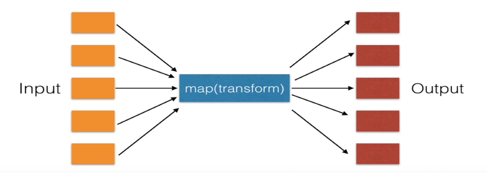
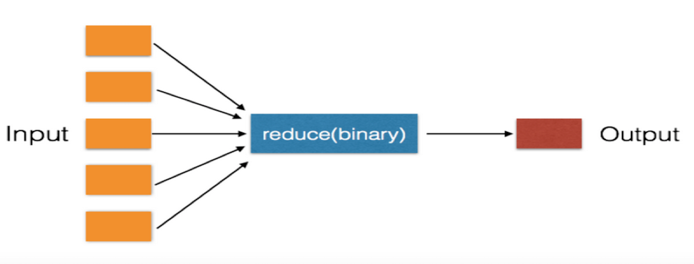
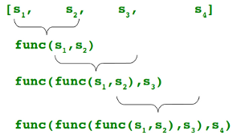
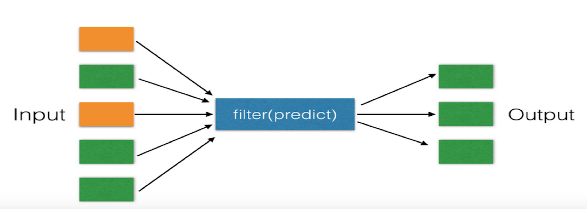

Python High Order Function

参数中包含另一个函数的函数被称为高阶函数（High Order Function）。

# 简单例子

```python
# 函数名作为参数使用
def add_f(x, y, f):
    return f(x) + f(y)

print(add_f(1, -1, abs))
```

# 常用built-in高阶函数

## map

对已有序列中的每个元素做处理，得到同样大小的新序列。



单个序列：

```python
# x*x
list(map(lambda x:x*x, range(5)))
```

两个序列：

```python
a = [1,2,3]
b = [4,5,6]
# x*y
list(map(lambda x,y:x*y, a,b)
```

三个序列类似，同样可以实现。

## reduce

对序列的前两个元素做函数运算，得到的结果和第三个元素一起做相同的函数运算。重复这个操作直到序列的最后一个元素，最后输出一个运算结果。

注意，reduce中的函数必须是双目运算。





```python
from functools import reduce
a = [1,2,3]

reduce(lambda x,y:x*y, a)
```

上述代码实现了简单的求和运算，当然可以直接用sum()实现。

## filter

对序列进行筛选，输出符合筛选条件的新序列。新列表为原序列的一部分。



```python
a = [1,2,3]
# >1
list(filter(lambda x,x>1, a)
```

上述代码，输出所有大于1的元素组成的新序列。

# 参考

https://www.cnblogs.com/guigujun/p/6134828.html

https://www.python-course.eu/python3_lambda.php